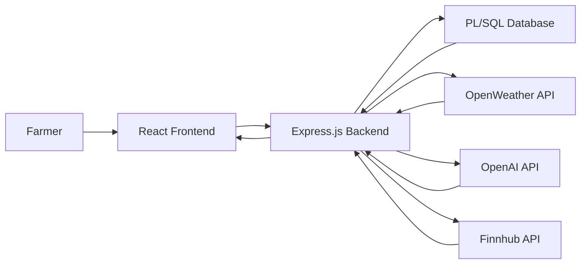
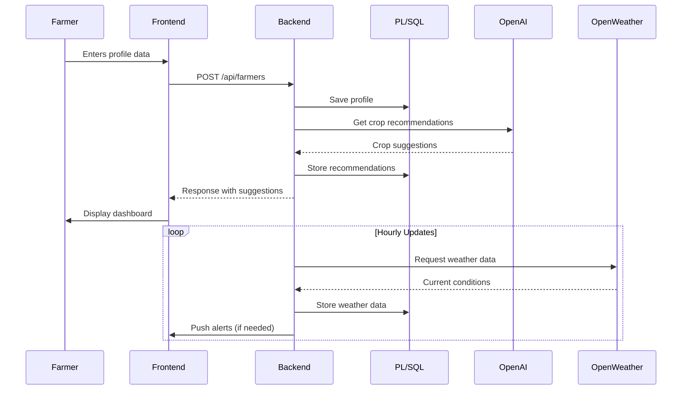

# FarmPulse: Technical Implementation Overview

link:https://v0-hack-drill.vercel.app/dashboard

## System Architecture

## Frontend Implementation (React + TypeScript + Tailwind CSS)

### Core Components
1. **User Profile Manager**
   - Collects soil type, region, and crop history via form
   - Stores preferences in local storage
   - Syncs with backend via REST API

2. **Dashboard Layout**
   - Responsive grid with Tailwind CSS
   - Modular widgets for different data types
   - Dark/light mode support

3. **Data Visualization**
   - Market price charts (Finnhub data)
   - Weather forecast cards (OpenWeather data)
   - Interactive crop recommendation cards

4. **Alert System**
   - Real-time notification center
   - Color-coded urgency indicators
   - Historical alert browser

### Key Technical Choices
- **State Management**: React Context API + useReducer
- **Routing**: React Router v6 with protected routes
- **Data Fetching**: Axios with interceptors for API calls
- **Styling**: Tailwind CSS with custom theme configuration
- **Type Safety**: TypeScript interfaces for all API responses

## Backend Implementation (Express.js + PL/SQL)

### API Endpoints
1. **Farmer Profile Service**
   - `POST /api/farmers`: Create new farmer profile
   - `GET /api/farmers/:id`: Retrieve farmer data
   - `PUT /api/farmers/:id`: Update profile information

2. **Weather Service**
   - `GET /api/weather/:region`: Fetch current weather and forecasts
   - `POST /api/weather/alerts`: Setup weather alert subscriptions

3. **Market Data Service**
   - `GET /api/market/prices`: Retrieve commodity prices
   - `GET /api/market/trends`: Get historical price trends

4. **Advisory Service**
   - `POST /api/advisory/recommend`: Generate crop suggestions
   - `GET /api/advisory/pests`: Get pest alerts for region

### Database Structure (PL/SQL)
- **Farmers Table**: Stores farmer profiles and preferences
- **Crop History Table**: Tracks planting/harvest records
- **Weather Alerts Table**: Manages subscription settings
- **Market Data Cache**: Stores recent price information

### API Integration Workflow
1. **OpenWeather API**
   - Hourly weather data fetching via cron jobs
   - Severe weather detection algorithm
   - Alert triggering mechanism

2. **OpenAI API**
   - Prompt engineering for crop recommendations
   - Response validation and sanitization
   - Caching frequent queries

3. **Finnhub API**
   - Daily commodity price updates
   - Trend analysis for major crops
   - Regional price comparison

## Data Flow Sequence

## Deployment Setup

### Prerequisites
- Node.js v18+ (both frontend and backend)
- Oracle Database 19c+
- API keys for:
  - OpenWeather (free tier available)
  - OpenAI (GPT-4 access required)
  - Finnhub (free tier available)

### Environment Configuration
1. **Backend (.env)**
   - Database credentials
   - API keys for external services
   - Server port configuration

2. **Frontend (.env)**
   - Backend API base URL
   - Mapbox access token (optional)
   - Analytics tracking ID (optional)

### Build Process
1. **Frontend**
   - `npm run build`: Creates production-ready React app
   - Output: Static files in `/build` directory

2. **Backend**
   - `npm run build`: Compiles TypeScript to JavaScript
   - Output: JavaScript in `/dist` directory

### Execution
1. Start backend service: `npm start` in backend directory
2. Serve frontend: Use NGINX or serve static build files
3. Configure reverse proxy for API access

## Security Considerations
1. **API Key Protection**: Environment variables only
2. **Data Encryption**: HTTPS mandatory, database encryption
3. **Input Validation**: All user input sanitized
4. **Rate Limiting**: Express-rate-limit middleware
5. **CORS**: Strict origin restrictions

## Performance Optimization
1. **Database Caching**: Frequent queries cached
2. **API Response Caching**: Redis for external API data
3. **Lazy Loading**: Frontend components load on demand
4. **Image Optimization**: Compressed assets
5. **Code Splitting**: React dynamic imports

## Monitoring and Maintenance
1. **Logging**: Winston logger with daily rotation
2. **Health Checks**: `/status` endpoint monitoring
3. **Error Tracking**: Sentry integration
4. **Alerting**: Slack notifications for critical errors
5. **Scheduled Tasks**: Cron jobs for data updates
